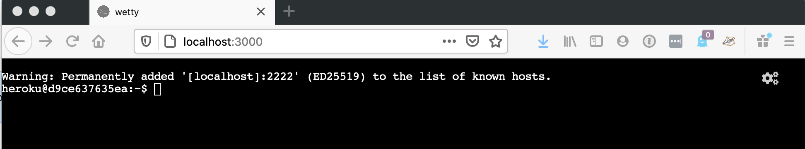

# Web TTY Buildpack


This is a [Cloud Native Buildpack](https://buildpacks.io) that create a terminal session in a browser for your container.

You can build this using [pack](https://buildpacks.io/docs/tools/pack/).

## Usage

```
$ echo '{"engines":{"node":"14.x"}}' > package.json
$ touch requirements.txt
$ pack build --buildpack jkutner/web-tty myapp
```

You can add other buildpacks using the `--buildpack` option (or `-b` for short) multiple times.

Then run your app

```
docker run -it -p 3000:3000 myapp
```

Open a browser to `localhost:3000` and you'll see something like:



## Customizing

By default, the buildpack starts the terminal in a bash session. But you can override this with the `WEB_TTY_CMD` env var at build-time. For example, the following command will start the session in a Python REPL:

```
$ pack build -b jkutner/web-tty -e WEB_TTY_CMD=python myapp
```

If the terminal session is not your primary web process, you can override the port it uses by setting `WEB_TTY_PORT` at run-time. By defaul it will use `PORT` or `3000`. Then have you primary web process run the `wetty.sh` script in the background, and your primary HTTP server and proxy to your `WEB_TTY_PORT` port.

## How it works

This buildpack installs [wetty](https://github.com/butlerx/wetty) into your image.
